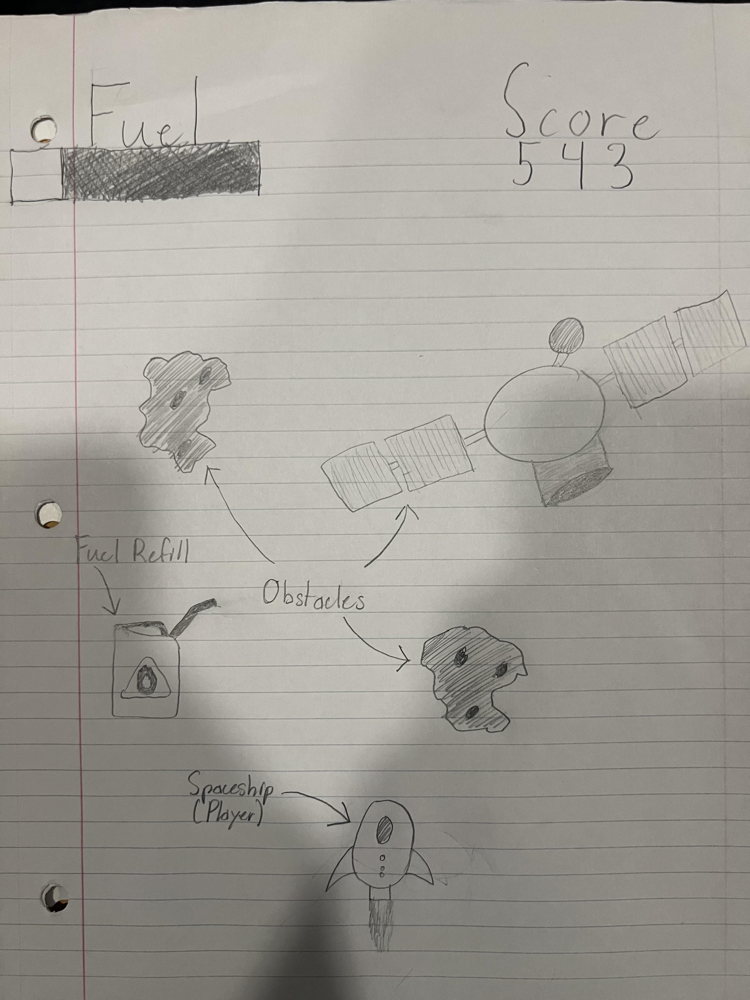
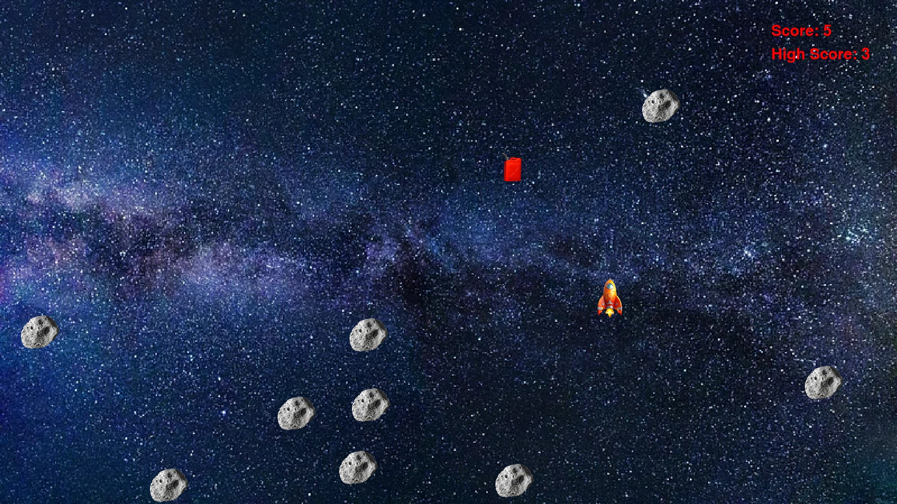

:warning: Everything between << >> needs to be replaced (remove << >> after replacing)

# Space Racers
## CS110 Final Project  Fall, 2024

## Team Members

Landon Kozdemba

***

## Project Description

My project will be a game where you control a spacecraft through the vast darkness of space.  Your goal is to make it as far as you can while avoiding space debris and collecting fuel to make sure your spacecraft can fly.  Your score will accumulate the longer you fly, and the highest scores will be saved in a leaderboard shown to the player.

***    

## GUI Design

### Initial Design

### Final Design

## Program Design

### Features

1. << Feature 1 >>
2. << Feature 2 >>
3. << Feature 3 >>
4. << Feature 4 >>
5. << Feature 5 >>

### Classes

- << You should have a list of each of your classes with a description >>

## ATP

| Step                 |Procedure             |Expected Results                   |
|----------------------|:--------------------:|----------------------------------:|
|  1                   | Run Counter Program  |GUI window appears with count = 0  |
|  2                   | click count button   | display changes to count = 1      |
etc...
